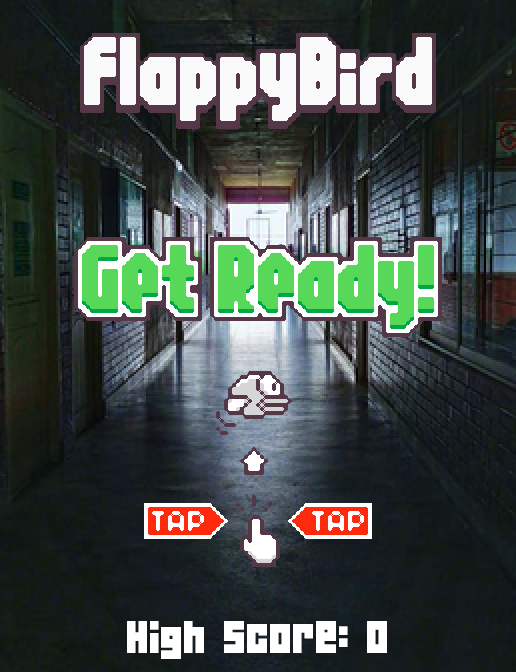
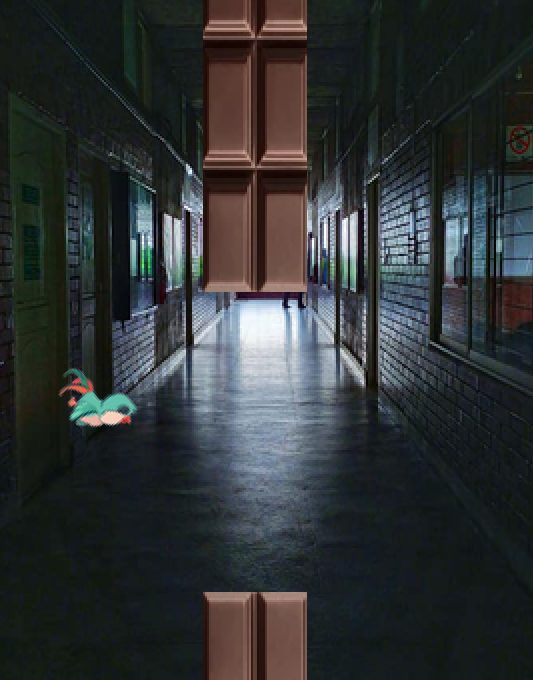

A Flappy Bird in IUBAT using Python

A flappy bird in IUBAT using the python-pygame library. Here a flappy bird is passing through some obstacles, for each passed obstacle it adds 1 point to the score. Generally, the bird will try to fall down, but the user has to move it up to survive. If the bird somehow touches the obstacles or falls down or touches the higher part of the screen, then the game ends and it will show the points which the user gained. If the user scores more than the previous high score, then the new high score will be the recent score. In the background, you can use your customized image. Here, I used my university (IUBAT) corridor area as a background image. For playing the game, the keys which the user has to press are following below:

1. Moving Up -> Space Key
2. Cancel -> Esc Key

